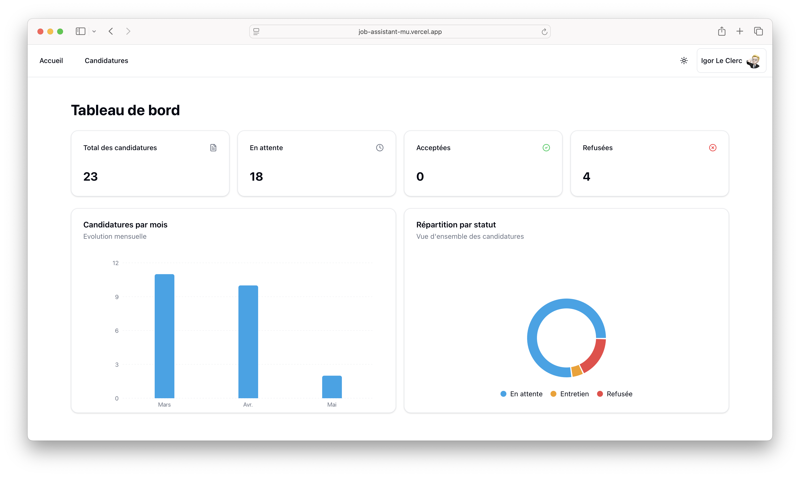

# 💼 Job Assistant

Un assistant intelligent et simple pour suivre tes candidatures d’emploi.  
Ajoute, consulte, et organise toutes tes candidatures en un seul endroit.

---

## 🚀 Fonctionnalités

- 📋 Ajout rapide d'une candidature
- 🕒 Suivi de l’état : en attente, relancé, entretien, refusé, etc.
- 🗃️ Stockage des candidatures dans Firebase
- 📱 Design responsive compatible mobile (en cours d'adaptation)
- 🔐 Authentification simple

---

## 🖼️ Aperçus de l’application

### Page d’accueil


---

### Formulaire d’ajout d’une candidature


---

### Liste des candidatures


---

## ⚙️ Stack Technique

- **Next.js  (App Router)**
- **TypeScript**
- **ShadCN ui**
- **TailwindCSS**
- **Firebase (auth & base de données)**
- **Vercel (déploiement)**

---

## 📦 Installation

```bash
git clone https://github.com/ton-pseudo/job-assistant.git
cd job-assistant
npm install
npm run dev
```

## 🛠️ Configuration

    1.	Crée un fichier .env.local :
    ```bash
    NEXT_PUBLIC_FIREBASE_API_KEY=...
    NEXT_PUBLIC_FIREBASE_AUTH_DOMAIN=...
    NEXT_PUBLIC_FIREBASE_PROJECT_ID=...
    NEXT_PUBLIC_FIREBASE_STORAGE_BUCKET=...
    NEXT_PUBLIC_FIREBASE_MESSAGING_SENDER_ID=...
    NEXT_PUBLIC_FIREBASE_APP_ID=...```
    
    2. Lance l'application :
    ```bash
    pnpm run dev
    ````
## 🤝 Contribuer
Les contributions sont les bienvenues ! N’hésite pas à ouvrir une issue ou une PR 🙌

## 📄 License

Ce projet est sous licence :
**Creative Commons Attribution-NonCommercial-NoDerivatives 4.0 International**.

Vous ne pouvez pas utiliser ce projet à des fins commerciales sans autorisation explicite.
Aucune modification ni création de travaux dérivés n'est autorisée.
Consultez la licence complète dans le fichier [`LICENSE`](./LICENSE).

## 🧑‍💻 Développé par
@igorleclerc avec ❤️